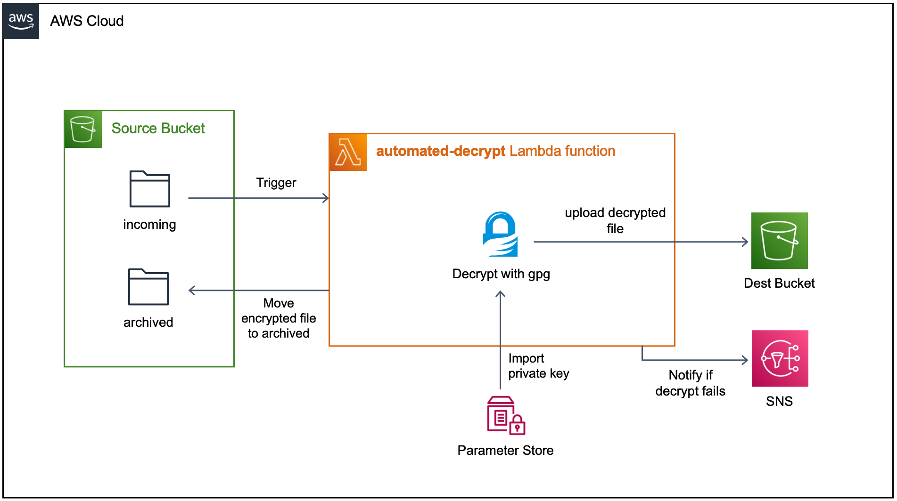

# Automated file decryption in AWS with Python 

In this project, there are files encrypted with gpg (public key) being uploading into a source S3 bucket, in an "incoming/" folder. This triggers the "automated-decrypt" AWS Lambda function. The function does the following:

- Checks to see if the file is already decrypted, and filters based on extension.
- Downloads the file from the S3 source bucket to /tmp/ in Lambda's execution context.
- Decrypts the file using the appropriate private key stored in AWS Systems Manager - Parameter Store and gpg library in Python.
- If the file decrypts successfully, the decrypted file is uploaded to the destination S3 bucket, and move the encrypted file from the incoming/ folder in the source S3 bucket to the archived/ folder in the source S3 bucket.
- If the file __fails__ to decrypt, an SNS message will be sent to an SNS topic.
- Finally, the cleans up by deleting files in the /tmp/ folder.

### Below is a diagram of the architecture:

### Lambda Function Setup for `gnupg` Python library:

To make the library you need both the `gpnug` python library and the `gpg` executable. You can either install these through a Lambda Layer (as I did), or simply store the 2 files alongside your Lambda file in the same directory.